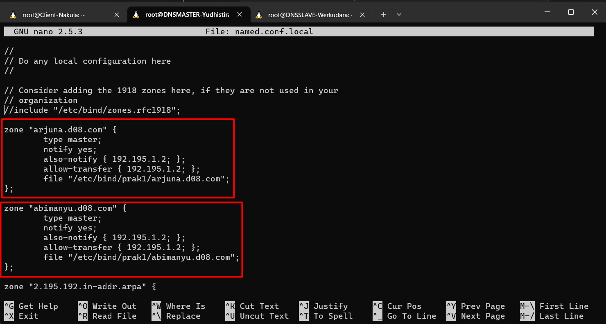
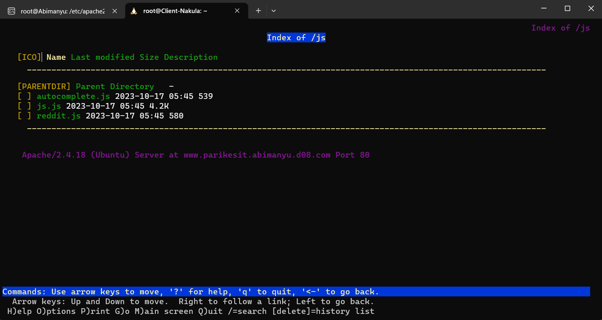
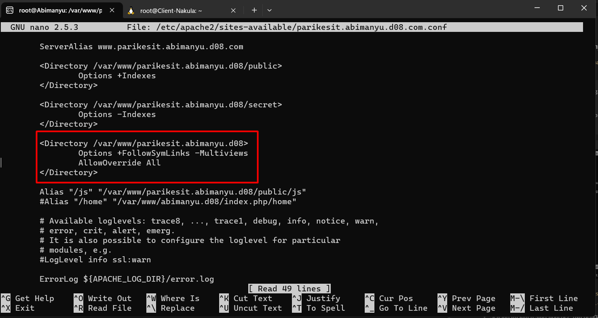

# 🖥️🖥️ Jarkom-Modul-2-D08-2023 🖥️🖥️

Nama Anggota | NRP
------------------- | --------------		
Timothy Hosia Budianto | 5025211098
Arif Nugraha Santosa | 5025211048

## 🟩🟩  IP ADDRESS KELOMPOK D08 🟩🟩 
### DNS Server:
Werkudara (DNS Slave):
```
auto eth0
iface eth0 inet static
	address 192.195.1.2
	netmask 255.255.255.0
	gateway 192.195.1.1
```
Yudhistira (DNS Master):
```
auto eth0
iface eth0 inet static
	address 192.195.1.3
	netmask 255.255.255.0
	gateway 192.195.1.1
```

### Web Server
Arjuna (LB):
```
auto eth0
iface eth0 inet static
	address 192.195.2.2
	netmask 255.255.255.0
	gateway 192.195.2.1
```
Wisanggeni:
```
auto eth0
iface eth0 inet static
	address 192.195.2.3
	netmask 255.255.255.0
	gateway 192.195.2.1
```
Prabukusuma:
```
auto eth0
iface eth0 inet static
	address 192.195.2.4
	netmask 255.255.255.0
	gateway 192.195.2.1
```
Abimanyu:
```
auto eth0
iface eth0 inet static
	address 192.195.2.5
	netmask 255.255.255.0
	gateway 192.195.2.1
```

### Client
__NOTE: SETIAP CLIENT NAMESERVER PADA FILE "/etc/resolv.conf" MENGARAH KE IP DNS MASTER DAN DNS SLAVE"__

Nakula:
```
auto eth0
iface eth0 inet static
	address 192.195.3.2
	netmask 255.255.255.0
	gateway 192.195.3.1
```
Sadewa:
```
auto eth0
iface eth0 inet static
	address 192.195.3.3
	netmask 255.255.255.0
	gateway 192.195.3.1
```

### Router
Pandudewanata:
```
eth0: DHCP dari NAT
eth1: 192.195.1.1 (ke DNS server)
eth2: 192.195.2.1 (ke Web server)
eth3: 192.195.3.1 (ke client)
```

## 🟩🟩 PENYELESAIAN 🟩🟩

### ⭕ Nomor 1
Yudhistira akan digunakan sebagai DNS Master, Werkudara sebagai DNS Slave, Arjuna merupakan Load Balancer yang terdiri dari beberapa Web Server yaitu Prabakusuma, Abimanyu, dan Wisanggeni. Buatlah topologi dengan pembagian sebagai berikut. Folder topologi dapat diakses pada drive berikut.

### 🟢 Jawaban Nomor 1
### 1️⃣ Membuat Topologi
- Susun topologi dan koneksi tiap node seperti pada gambar di bawah.


- Set iptable di router (**iptables -t nat -A POSTROUTING -o eth0 -j MASQUERADE -s 192.195.0.0/16**).

- Echo nameserver di node DNS Server dan DNS Server, untuk connect dengan router agar terconnect dengan internet `echo nameserver 192.168.122.1 > /etc/resolv.conf`

### ⭕ Nomor 2 & Nomor 3

Buatlah website utama pada node arjuna dengan akses ke arjuna.yyy.com dengan alias www.arjuna.yyy.com dengan yyy merupakan kode kelompok.

Dengan cara yang sama seperti soal nomor 2, buatlah website utama dengan akses ke abimanyu.yyy.com dan alias www.abimanyu.yyy.com.

### 🟢 Jawaban Nomor 2 & Nomor 3
### 2️⃣&3️⃣ Membuat DNS Server

- Pada nomor 2 dan 3, kita akan fokus untuk melakukan konfigurasi DNS Server terlebih dahulu pada `Yudhistira` dan `Werkudara`

- Pertama, instalasi bind pada `Yudhistira` dan `Werkudara` dengan menggunakan command:
```sh
apt-get update
apt-get install bind9 -y
```
- Lalu pada `Yudhistira` setting konfigurasi local dengan command:
```sh
nano /etc/bind/named.conf.local
```
- Tambahkan konfigurasi berikut:
```sh
zone "arjuna.d08.com" {
        type master;
        file "/etc/bind/prak1/arjuna.d08.com";
};

zone "abimanyu.d08.com" {
        type master;
        file "/etc/bind/prak1/abimanyu.d08.com";
};
```


- Kemudian buatlah direktori `prak1` dalam folder `/etc/bind`.
```sh
mkdir /etc/bind/prak1
```

- Copy file db.local pada path `/etc/bind` ke dalam folder `prak1` yang baru saja dibuat dan ubah namanya menjadi `arjuna.d08.com` dan `abimanyu.d08.com`
```sh
cp /etc/bind/db.local /etc/bind/prak1/arjuna.d08.com
```
👆🏻Untuk zone `arjuna.d08.com` 👇🏻Untuk zone `abimanyu.d08.com`
```sh
cp /etc/bind/db.local /etc/bind/prak1/abimanyu.d08.com
```

- Kemudian konfigurasi `arjuna.d08.com` dan `abimanyu.d08.com`

`Zone arjuna.d08.com`


`Zone abimanyu.d08.com`


- Lakukan DNS forwarding, agar client dapat mengakses internet. Edit file `/etc/bind/named.conf.options` Pada server DNS Master

Nyalakan forwaders agar mengarah ke `192.168.122.1`


- Lalu restart bind9nya dengan command:
```sh
service bind9 restart
```

- Arahkan nameserver `nakula` dan `sadewa` dengan dan tulis nameserver ip dns master kita, untuk mencoba ping arjuna dan abimanyu:
```sh
nano /etc/resolv.conf
```
Berisi:
```sh
nameserver 192.195.1.3
nameserver 192.195.1.2
```

### 2️⃣&3️⃣ Testing Nomor 2 & Nomor 3

- Ping dengan domain `arjuna.d08.com` dan `abimanyu.d08.com` serta coba ping dengan menggunakan aliasnya:


Ping sudah berhasil dan domain arjuna mengarah ke ip arjuna, dan domain abimanyu mengarah ke domain abimanyu.

- Ping ke `google.com`


### ⭕ Nomor 4
Kemudian, karena terdapat beberapa web yang harus di-deploy, buatlah subdomain parikesit.abimanyu.yyy.com yang diatur DNS-nya di Yudhistira dan mengarah ke Abimanyu.

### 🟢 Jawaban Nomor 4
### 4️⃣ Membuat Subdomain parikesit

- Gunakan command `nano /etc/bind/prak1/abimanyu.d08.com`dan masukan konfigurasi yang ditandai berwarna merah pada gambar di bawah:


### 4️⃣ Testing Nomor 4
- Lakukan ping pada subdomain `parikesit.abimanyu.d08.com` dan aliasnya dengan command:
```sh
ping parikesit.abimanyu.d08.com
```
Dan
```sh
ping www.parikesit.abimanyu.d08.com
```


### ⭕ Nomor 5
Buat juga reverse domain untuk domain utama. (Abimanyu saja yang direverse)

### 🟢 Jawaban Nomor 5
### 5️⃣ Membuat Reverse Domain Abimanyu

- Lalu pada `Yudhistira` setting konfigurasi local dengan command:
```sh
nano /etc/bind/named.conf.local
```

- Tambahkan zone baru untuk reverse DNSnya seperti gambar di bawah:
```sh
zone "2.195.192.in-addr.arpa" {
        type master;
        file "/etc/bind/prak1/2.195.192.in-addr.arpa";
};
```


- Lakukan hal yang sama seperti pada nomor 2 dan 3. File `db.local` dari path `/etc/bind` ke dalam folder `prak1` yang baru saja dibuat dan ubah namanya menjadi `2.195.192.in-addr.arpa`. Kemudian edit file dengan command `nano /etc/bind/prak1/2.195.192.in-addr.arpa` menjadi di bawah ini:


- Lalu restart bind9nya dengan command:
```sh
service bind9 restart
```

### 5️⃣ Testing Nomor 5
- Untuk mengecek apakah konfigurasi sudah benar atau belum, lakukan perintah berikut pada client:
```sh
host -t PTR 192.195.2.5
```


### ⭕ Nomor 6
Agar dapat tetap dihubungi ketika DNS Server Yudhistira bermasalah, buat juga Werkudara sebagai DNS Slave untuk domain utama.

### 🟢 Jawaban Nomor 6
### 6️⃣ Membuat Konfigurasi DNS Master Dahulu

- Pada `Yudhistira` (DNS Master) setting konfigurasi local dengan command:
```sh
nano /etc/bind/named.conf.local
```
- Isi konfigurasi berikut
```sh
zone "arjuna.d08.com" {
        type master;
        notify yes;
        also-notify { 192.195.1.2; };
        allow-transfer { 192.195.1.2; };
        file "/etc/bind/prak1/arjuna.d08.com";
};

zone "abimanyu.d08.com" {
        type master;
        notify yes;
        also-notify { 192.195.1.2; };
        allow-transfer { 192.195.1.2; };
        file "/etc/bind/prak1/abimanyu.d08.com";
};
```


- Lalu restart bind9nya dengan command:
```sh
service bind9 restart
```

### 6️⃣ Konfigurasi DNS Slave

- Pastikan kita sudah melakukan instalasi bind9 di DNS Slavenya `Werkudara`. Apabila belum, gunakan command berikut:
```
apt-get update
apt-get install bind9 -y
```

- Masuk ke `/etc/bind/` dan edit file `named.conf.local`, lalu masukan konfigurasi berikut:
```sh
zone "arjuna.d08.com" {
    type slave;
    masters { 192.195.1.3; };
    file "/var/lib/bind/arjuna.d08.com";
};

zone "abimanyu.d08.com" {
    type slave;
    masters { 192.195.1.3; };
    file "/var/lib/bind/abimanyu.d08.com";
};
```
- Lalu restart bind9nya dengan command:
```sh
service bind9 restart
```

### 6️⃣ Testing Nomor 6

- Matikan server DNS master (Yudhistira) dengan command `service bind9 stop`
- Pastikan client sudah menginstall `dnsutils` apabila belum, menggunakan command berikut:
```sh
apt-get install dnsutils -y
```
- Lalu lakukan `nslookup` dengan command berikut:
```sh
nslookup www.abimanyu.d08.com
```
Dan
```sh
nslookup www.arjuna.d08.com
```


Dapat dilihat, bahwa saat melakukan `nslookup` ke alias masing-masing domain, server yang menghandle adalah `192.195.1.2` yang mana itu adalah IP dari `Werkudara`

### ⭕ Nomor 7 ➡️ Nomor 8
Seperti yang kita tahu karena banyak sekali informasi yang harus diterima, buatlah subdomain khusus untuk perang yaitu baratayuda.abimanyu.yyy.com dengan alias www.baratayuda.abimanyu.yyy.com yang didelegasikan dari Yudhistira ke Werkudara dengan IP menuju ke Abimanyu dalam folder Baratayuda.

Untuk informasi yang lebih spesifik mengenai Ranjapan Baratayuda, buatlah subdomain melalui Werkudara dengan akses rjp.baratayuda.abimanyu.yyy.com dengan alias www.rjp.baratayuda.abimanyu.yyy.com yang mengarah ke Abimanyu.

### 🟢 Jawaban Nomor 7 ➡️ Nomor 8
### 7️⃣&8️⃣ Setting Delegasi Pada DNS Master

- Pertama, modifikasi konfigurasi `abimanyu.d08.com` pada `/etc/bind/prak1` di dnsmaster untuk prefix baratayuda diarahkan ke dns slave menjadi:
```sh
ns1     	IN      A       192.195.1.2     ;IP Werkudara
baratayuda	IN      NS      ns1
```


- Jangan lupa untuk modifikasi `named.conf.options`. Comment `dnssec-validation auto;` dan tambahkan allow-query{any;}; Pada DNS Master dan Slave.


- Pastikan pada file `named.nonf.local` domain `Abimanyu` di beri allow transfer ke DNS Slave.


- Lalu restart bind9nya dengan command:
```sh
service bind9 restart
```
### 7️⃣&8️⃣ Setting Delegasi Pada DNS Slave

- Pada `Werkudara` edit file `/etc/bind/named.conf.options`:
```sh
nano /etc/bind/named.conf.options
```
Kemudian edit filenya menjadi seperti gambar di bawah:


- Lalu edit file `/etc/bind/named.conf.local` menjadi seperti gambar di bawah:


- Buatlah folder `delegasi` dalam folder `/etc/bind`
```sh
mkdir /etc/bind/delegasi
```
- Copy file `/etc/bind/db.local` ke folder `delegasi` yang baru saja dibuat.
```sh
cp /etc/bind/db.local /etc/bind/delegasi/baratayuda.abimanyu.d08.com
```
- Modifikasi file `baratayuda.abimanyu.d08.com` menjadi seperti berikut:


- Lalu restart bind9nya dengan command:
```sh
service bind9 restart
```
### 7️⃣&8️⃣ Testing Nomor 7 & Nomor 8

- Lakukan nslookup ke kedua domain yang sudah didelegasikan dengan command:
```sh
nslookup baratayuda.abimanyu.d08.com
nslookup www.baratayuda.abimanyu.d08.com
```
👆🏻`baratayuda.abimanyu.d08.com` 👇🏻`rjp.baratayuda.abimanyu.d08.com`
```sh
nslookup rjp.baratayuda.abimanyu.d08.com
nslookup www.rjp.baratayuda.abimanyu.d08.com
```

Hasil:


### ⭕ Nomor 9 ➡️ Nomor 10
Arjuna merupakan suatu Load Balancer Nginx dengan tiga worker (yang juga menggunakan nginx sebagai webserver) yaitu Prabakusuma, Abimanyu, dan Wisanggeni. Lakukan deployment pada masing-masing worker.

Kemudian gunakan algoritma Round Robin untuk Load Balancer pada Arjuna. Gunakan server_name pada soal nomor 1. Untuk melakukan pengecekan akses alamat web tersebut kemudian pastikan worker yang digunakan untuk menangani permintaan akan berganti ganti secara acak. Untuk webserver di masing-masing worker wajib berjalan di port 8001-8003. Contoh
- Prabakusuma:8001
- Abimanyu:8002
- Wisanggeni:8003

### 🟢 Jawaban Nomor 9 ➡️ Nomor 10
### 9️⃣&🔟 Setting Worker
- Langkah pertama yang harus dilakukan adalah dengan melakukan instalasi `nginx` dan keperluan lainnya pada setiap worker dan load balancernya dengan perintah:
```sh
apt-get update && apt install nginx php php-fpm -y
apt-get install libapache2-mod-php7.0 wget unzip -y
```
- Kedua, pada setiap worker dan load balancer masukan perintah
```sh
service nginx start
```
- Ketiga, kita masuk pada direktori `/var/www`. Langkah ini dilakukan pada setiap worker saja.
```sh
cd /var/www
```
- Keempat, pada folder `/var/www` kita masukan file yang berisi asset pada file yang diberikan. Untuk mendownload assetnya kita akan menggunakan wget yaitu dengan command:
```sh
wget --no-check-certificate 'https://drive.google.com/uc?export=download&id=17tAM_XDKYWDvF-JJix1x7txvTBEax7vX' -O arjuna.d08.zip
```
- Kelima, file tersebut akan disimpan pada folder `/var/www`. Kemudian kita akan melakukan unzip dan menghapus file .zip dengan command: <br>
```sh
unzip arjuna.d08.zip && rm arjuna.d08.zip
```
__NOTE: JANGAN LUPA UNTUK MENGINSTALL UNZIP__
- Keenam, kita unzip file `arjuna.d08.zip`, seharusnya kita akan mendapatkan folder bernama `arjuna.yyy.com`. Kita akan merename folder tersebut menjadi `jarkom` dengan command:
```sh
mv arjuna.yyy.com jarkom
```

- di dalam folder `jarkom` yang telah kita buat akan berisi sebuah file `index.php` yang berisi:
```php
<?php
$hostname = gethostname();
$date = date('Y-m-d H:i:s');
$php_version = phpversion();
$username = get_current_user();

echo "Hello World!<br>";
echo "Saya adalah: $username<br>";
echo "Saat ini berada di: $hostname<br>";
echo "Versi PHP yang saya gunakan: $php_version<br>";
echo "Tanggal saat ini: $date<br>";
?>
```
__⬆️File tersebut akan memberitahukan kita berada di server mana.__ <br>

- Ketujuh, kita akan masuk ke direktori `/etc/nginx/sites-available` dengan command:
```sh
cd /etc/nginx/sites-available
```

- Kedelapan, kita akan membuat file baru yang bernama `jarkom` dengan command:
```sh
nano jarkom
```

- Kesembilan, kita akan memasukan konfigurasi berikut ke dalam file `jarkom`:

👉🏻 Pada Prabukusuma:
```sh
 server {

 	listen 8001;

 	root /var/www/jarkom;

 	index index.php index.html index.htm;
 	server_name _;

 	location / {
 			try_files $uri $uri/ /index.php?$query_string;
 	}

 	# pass PHP scripts to FastCGI server
 	location ~ \.php$ {
 	include snippets/fastcgi-php.conf;
 	fastcgi_pass unix:/var/run/php/php7.0-fpm.sock;
 	}

 location ~ /\.ht {
 			deny all;
 	}

 	error_log /var/log/nginx/jarkom_error.log;
 	access_log /var/log/nginx/jarkom_access.log;
 }
```
👉🏻 Pada Abimanyu:
```sh
 server {

 	listen 8002;

 	root /var/www/jarkom;

 	index index.php index.html index.htm;
 	server_name _;

 	location / {
 			try_files $uri $uri/ /index.php?$query_string;
 	}

 	# pass PHP scripts to FastCGI server
 	location ~ \.php$ {
 	include snippets/fastcgi-php.conf;
 	fastcgi_pass unix:/var/run/php/php7.0-fpm.sock;
 	}

 location ~ /\.ht {
 			deny all;
 	}

 	error_log /var/log/nginx/jarkom_error.log;
 	access_log /var/log/nginx/jarkom_access.log;
 }
```
👉🏻 Pada Wisanggeni:
```sh
 server {

 	listen 8003;

 	root /var/www/jarkom;

 	index index.php index.html index.htm;
 	server_name _;

 	location / {
 			try_files $uri $uri/ /index.php?$query_string;
 	}

 	# pass PHP scripts to FastCGI server
 	location ~ \.php$ {
 	include snippets/fastcgi-php.conf;
 	fastcgi_pass unix:/var/run/php/php7.0-fpm.sock;
 	}

 location ~ /\.ht {
 			deny all;
 	}

 	error_log /var/log/nginx/jarkom_error.log;
 	access_log /var/log/nginx/jarkom_access.log;
 }
```

 - Kesepuluh, kita akan menyimpan file tersebut dan akan membuat `symlink` dengan command:
 ```sh
ln -s /etc/nginx/sites-available/jarkom /etc/nginx/sites-enabled
 ```

 - Kesebelas, kita melakukan reload pada service `nginx` dengan command:
 ```sh
 service nginx restart
 ```
#### Penting!!!
```
📝📝 Perlu dicatat bahwa langkah ketiga hingga kesebelas dilakukan pada tiap worker yaitu Abimanyu, Prabukusuma, dan Wisanggeni. 📝📝
```

### 9️⃣&🔟 Setting Load Balancer
- Untuk melakukan setting pada load balancer, kita buka terminal pada load balancer kita yaitu `arjuna`.
- Pertama, kita akan masuk ke direktori `/etc/nginx/sites-available` dengan command:
```sh
cd /etc/nginx/sites-available
```

- Kedua, kita akan membuat file baru yang bernama `lb-arjuna` dengan command:
```sh
nano lb-arjuna
```

- Ketiga, kita akan memasukan konfigurasi berikut ke dalam file `lb-arjuna`:

👉🏻 Pada lb-arjuna:
```sh
 # Default menggunakan Round Robin
 upstream myweb {
 	server 192.195.2.4:8001; #Prabukusuma
	server 192.195.2.5:8002; #Abimanyu
	server 192.195.2.3:8003; #Wisanggeni
 }
 server {
 	listen 80;
 	server_name arjuna.d08.com;

 	location / {
 	proxy_pass http://myweb;
 	}
 }
```
- Keempat, simpan file tersebut dan buat `symlink` dengan command:
```sh
ln -s /etc/nginx/sites-available/lb-arjuna /etc/nginx/sites-enabled
```
 - Kelima, kita melakukan reload pada service `nginx` dengan command:
 ```hs
 service nginx restart
 ```

### 9️⃣&🔟 Testing Nomor 9 & 10
- Buka console salah satu client.
- Pastikan setiap client telah terinstall `lynx`. Apabila belum terinstall, gunakan command:
```sh
apt-get install lynx -y
```
- Kemudian masukan command:
```sh
lynx arjuna.d08.com
```
- Setelah menjalankan command tersebut, seharusnya kita akan mendapat tampilan web seperti di bawah ini.


__⬆️Setiap kali kita melakukan lynx ke domain arjuna, maka load balancer akan menunjuk salah satu worker untuk menampilkan webnya.__ <br>

### ⭕ Nomor 11
Selain menggunakan Nginx, lakukan konfigurasi Apache Web Server pada worker Abimanyu dengan web server www.abimanyu.yyy.com. Pertama dibutuhkan web server dengan DocumentRoot pada /var/www/abimanyu.yyy

### 🟢 Jawaban Nomor 11
### 1️⃣1️⃣ Setting Apache2 Pada Abimanyu

- Pada server `Abimanyu` lakukan instalasi berikut untuk memenuhi persyaratan.
```sh
apt-get install apache2 wget unzip -y
apt-get install libapache2-mod-php7.0 -y
```

- Setelah melakukan instalasi, kita masuk ke direktori `/etc/apache2/sites-available` dengan command:
```sh
cd /etc/apache2/sites-available
```

- Setelah itu kita akan mencopy file `000-default.conf` dengan command:
```sh
cp 000-default.conf abimanyu.d08.com.conf
```

- Di dalam file `abimanyu.d08.com.conf` kita tambahkan beberapa konfigurasi sehingga konfigurasinya menjadi:
```sh
<VirtualHost *:80>
        ServerAdmin webmaster@localhost
        DocumentRoot /var/www/abimanyu.d08
        ServerName abimanyu.d08.com
        ServerAlias www.abimanyu.d08.com
		
		ErrorLog ${APACHE_LOG_DIR}/error.log
        CustomLog ${APACHE_LOG_DIR}/access.log combined
</VirtualHost>
```
- Kita hanya menambahkan `ServerName` dan `ServerAlias` serta mengubah DocumentRoot-nya menjadi `/var/www/abimanyu.d08`
```sh
 ServerName abimanyu.d08.com
 ServerAlias www.abimanyu.d08.com
```

- Setelah itu kita akan menghapus file `000-default.conf` yang telah dienable dengan command:
```sh
rm /etc/apache2/sites-enabled/000-default.conf
```

- Lalu kita akan mengenable konfigurasi file `abimanyu.d08.com.conf` dengan command:
```sh
a2ensite abimanyu.d08.com.conf
```

- Kemudian kita akan pergi ke direktori `var/www` dengan command:
```sh
cd /var/www
```

- Pada direktori tersebut, kita akan mendownload file yang berisi konten `abimanyu.d08.com` dengan wget, berikut adalah commandnya:
```sh
wget --no-check-certificate "https://drive.google.com/uc?export=download&id=1a4V23hwK9S7hQEDEcv9FL14UkkrHc-Zc" -O abimanyu.d08.com.zip
```

- Setelah itu unzip file yang telah kita download dengan command:
```sh
unzip abimanyu.d08.com.zip
```

- Kemudian kita akan merename folder yang telah di-unzip menjadi `abimanyu.d08` dengan command:
```sh
mv abimanyu.yyy.com abimanyu.d08
```

- Dan hapus file hasil download zipnya dengan command:
```sh
rm -r abimanyu.d08.com.zip
```

- Setelah itu kita restart apache2-nya dengan command:
```sh
service apache2 restart
```

### 1️⃣1️⃣ Testing Nomor 11
- Buka client dan lakukan `lynx` pada `abimanyu.d08.com`:
```sh
lynx abimanyu.d08.com
```
atau
```sh
lynx www.abimanyu.d08.com
```
- Hasilnya akan menampilkan page di bawah:


### ⭕ Nomor 12
Setelah itu ubahlah agar url www.abimanyu.yyy.com/index.php/home menjadi www.abimanyu.yyy.com/home.

### 🟢 Jawaban Nomor 12
### 1️⃣2️⃣ Setting Apache2 Pada Abimanyu

- Tambahkan konfigurasi pada file `/etc/apache2/sites-available/abimanyu.d08.com.conf` menjadi seperti berikut:
```sh
Alias "/home" "/var/www/abimanyu.d08/index.php/home"
```
Atau seperti gambar di bawah: <br>


### 1️⃣2️⃣ Testing Nomor 12
- Hasil `lynx www.abimanyu.d08.com/home` pada client:


### ⭕ Nomor 13
Selain itu, pada subdomain www.parikesit.abimanyu.yyy.com, DocumentRoot disimpan pada /var/www/parikesit.abimanyu.yyy

### 🟢 Jawaban Nomor 13
### 1️⃣3️⃣ Setting Apache2 Pada Abimanyu
- Langkahnya sangat mirip dengan nomor 11.
- Pertama, kita masuk ke direktori `/etc/apache2/sites-available` dengan command:
```sh
cd /etc/apache2/sites-available
```

- Setelah itu kita akan mencopy file `abimanyu.d08.com.conf` dengan command:
```sh
cp abimanyu.d08.com.conf parikesit.abimanyu.d08.com.conf
```

- Di dalam file `parikesit.abimanyu.d08.com.conf` kita tambahkan beberapa konfigurasi sehingga konfigurasinya menjadi:
```sh
<VirtualHost *:80>
        ServerAdmin webmaster@localhost
        DocumentRoot /var/www/parikesit.abimanyu.d08
        ServerName parikesit.abimanyu.d08.com
        ServerAlias www.parikesit.abimanyu.d08.com
		
		ErrorLog ${APACHE_LOG_DIR}/error.log
        CustomLog ${APACHE_LOG_DIR}/access.log combined
</VirtualHost>
```
- Kita hanya menambahkan `ServerName` dan `ServerAlias` serta mengubah DocumentRoot-nya menjadi `/var/www/parikesit.abimanyu.d08`

- Lalu kita akan mengenable konfigurasi file `parikesit.abimanyu.d08.com.conf` dengan command:
```sh
a2ensite parikesit.abimanyu.d08.com.conf
```

- Kemudian kita akan pergi ke direktori `var/www` dengan command:
```sh
cd /var/www
```

- Pada direktori tersebut, kita akan mendownload file yang berisi konten `parikesit.abimanyu.d08.com` dengan wget, berikut adalah commandnya:
```sh
wget --no-check-certificate 'https://drive.google.com/uc?export=download&id=1LdbYntiYVF_NVNgJis1GLCLPEGyIOreS' -O parikesit.abimanyu.d08.com.zip
```

- Setelah itu unzip file yang telah kita download dengan command:
```sh
unzip parikesit.abimanyu.d08.com.zip
```

- Kemudian kita akan merename folder yang telah di-unzip menjadi `parikesit.abimanyu.d08` dengan command:
```sh
mv parikesit.abimanyu.yyy.com parikesit.abimanyu.d08
```

- Dan hapus file hasil download zipnya dengan command:
```sh
rm -r parikesit.abimanyu.d08.com.zip
```

- Setelah itu kita restart apache2-nya dengan command:
```sh
service apache2 restart
```

### 1️⃣3️⃣ Testing Nomor 13
- Hasil `lynx www.parikesit.abimanyu.d08.com` pada client:


Akan muncul tampilan diatas, dimana kita bisa melihat directory listing sesuai isinya.

### ⭕ Nomor 14
Pada subdomain tersebut folder /public hanya dapat melakukan directory listing sedangkan pada folder /secret tidak dapat diakses (403 Forbidden).

### 🟢 Jawaban Nomor 14
### 1️⃣4️⃣ Setting Apache2 Pada Abimanyu

- Untuk nomor 14, tambahkan konfigurasi pada file `/etc/apache2/sites-available/parikesit.abimanyu.d08.com.conf` seperti berikut:
```sh
<Directory /var/www/parikesit.abimanyu.d08/public>
	Options +Indexes
</Directory>

<Directory /var/www/parikesit.abimanyu.d08/secret>
    Options -Indexes
</Directory>
```


- Code tersebut memberi perintah agar folder secret tidak dapat diakses (403 forbidden).

- Setelah itu kita restart apache2-nya dengan command:
```sh
service apache2 restart
```

### 1️⃣4️⃣ Testing Nomor 14

- `lynx www.parikesit.abimanyu.d08.com/public`


- `lynx www.parikesit.abimanyu.d08.com/secret` 


### ⭕ Nomor 15
Buatlah kustomisasi halaman error pada folder /error untuk mengganti error kode pada Apache. Error kode yang perlu diganti adalah 404 Not Found dan 403 Forbidden.

### 🟢 Jawaban Nomor 15
### 1️⃣5️⃣ Setting .htaccess pada Abimanyu

- Pertama, kita jalankan perintah berikut untuk mengaktifkan module rewrite:
```sh
a2enmod rewrite
```

- Kemudian kita perlu membuat sebuah file `.htaccess` pada direktori `/var/www/parikesit.abimanyu.d08` dengan command:
```sh
nano /var/www/parikesit.abimanyu.d08/.htaccess
```

- Lalu kita isikan file `.htaccess`nya dengan kode berikut:
```sh
RewriteEngine On
RewriteCond %{REQUEST_FILENAME} !-d
RewriteRule ^([^\.]+)$ $1.php [NC,L]
ErrorDocument 404 /error/404.html
ErrorDocument 403 /error/403.html
```


- Pada file `/etc/apache2/sites-available/parikesit.abimanyu.d08.com.conf` tambahkan konfigurasi berikut:
```sh
<Directory /var/www/parikesit.abimanyu.d08>
    Options +FollowSymLinks -Multiviews
    AllowOverride All
</Directory>
```


- Setelah itu kita restart apache2-nya dengan command:
```sh
service apache2 restart
```

### 1️⃣5️⃣ Testing Nomor 15

- `lynx www.parikesit.abimanyu.d08.com/secret`

__Folder /secret sudah diatur agar tidak dapat menampilkan direktori listing (403 Forbidden)__


- `lynx www.parikesit.abimanyu.d08.com/xixixixi`

__Folder /xixixixi tidak ada, maka errornya adalah 404 Not Found__


### ⭕ Nomor 16
Buatlah suatu konfigurasi virtual host agar file asset www.parikesit.abimanyu.yyy.com/public/js menjadi www.parikesit.abimanyu.yyy.com/js 

### 🟢 Jawaban Nomor 16
### 1️⃣6️⃣ Setting Apache2 Pada Abimanyu

- Pada file `/etc/apache2/sites-available/parikesit.abimanyu.d08.com.conf` tambahkan konfigurasi berikut:
```sh
Alias "/js" "/var/www/parikesit.abimanyu.d08/public/js"
```


- Setelah itu kita restart apache2-nya dengan command:
```sh
service apache2 restart
```

### 1️⃣6️⃣ Testing Nomor 16

- `lynx www.parikesit.abimanyu.d08.com/js`



### ⭕ Nomor 17 ➡️ Nomor 18
Agar aman, buatlah konfigurasi agar www.rjp.baratayuda.abimanyu.yyy.com hanya dapat diakses melalui port 14000 dan 14400.

Untuk mengaksesnya buatlah autentikasi username berupa “Wayang” dan password “baratayudayyy” dengan yyy merupakan kode kelompok. Letakkan DocumentRoot pada /var/www/rjp.baratayuda.abimanyu.yyy.

### 🟢 Jawaban Nomor 17 ➡️ Nomor 18
### 1️⃣7️⃣&1️⃣8️⃣Setting Apache2, .htaccess, .htpasswd Pada Abimanyu

- Untuk nomor 17, kita perlu melakukan deployment yang sama seperti pada nomor 11, dan 13. Disini, kita asumsikan kita sudah melakukan setting pada folder `/etc/apache2/sites-available` dan melakukan `a2ensite rjp.baratayuda.abimanyu.d08.com.conf` serta melakukan download asset pada folder `/var/www` yang kemudian foldernya diberi nama `rjp.baratayuda.abimanyu.d08`

- Berikut adalah isi file `rjp.baratayuda.abimanyu.d08.com.conf` pada folder `/etc/apache2/sites-available`:
```sh
<VirtualHost *:14000 *:14400>

        ServerAdmin webmaster@localhost
        DocumentRoot /var/www/rjp.baratayuda.abimanyu.d08
        ServerName rjp.baratayuda.abimanyu.d08.com
        ServerAlias www.rjp.baratayuda.abimanyu.d08.com

		<Directory /var/www/rjp.baratayuda.abimanyu.d08>
                Options +FollowSymLinks -Multiviews
                AllowOverride All
                AuthType Basic
                AuthName "Restricted Content"
                AuthUserFile /var/www/rjp.baratayuda.abimanyu.d08/.htpasswd
                Require valid-user
        </Directory>

		ErrorLog ${APACHE_LOG_DIR}/error.log
        CustomLog ${APACHE_LOG_DIR}/access.log combined
</VirtualHost>
```
__Berikut isi file rjp.baratayuda.abimanyu.d08.com.conf:__


- Lalu, kita akan masuk ke direktori `/var/www/rjp.baratayuda.abimanyu.d08` yang di sana kita akan membuat file `.htaccess` dan `.htpasswd`. Berikut adalah isinya:

- `.htaccess`
```sh
RewriteEngine On
RewriteCond %{REQUEST_FILENAME} !-d
RewriteRule ^([^\.]+)$ $1.php [NC,L]
```

- Dan untuk membuat file `.htpasswd`, dapat melalui langkah berikut:
	- gunakan command `htpasswd -c /var/www/rjp.baratayuda.abimanyu.d08 Wayang`
	- Setelah itu kita akan diminta untuk memasukan passwordnya. Ketikan passwordnya dan isi `baratayudad08`.
- `.htpasswd`
```sh
Wayang:$apr1$aejmbDtH$QByjsGPIg4FzPWKmJS4VE0
```

- Setelah itu kita restart apache2-nya dengan command:
```sh
service apache2 restart
```

### 1️⃣7️⃣&1️⃣8️⃣ Testing Nomor 17 ➡️ Nomor 18

- `lynx www.rjp.baratayuda.abimanyu.d08.com:14000` tanpa menggunakan auth Wayang.

__NOTE: HANYA ALERT__


__DAPAT DILIHAT BAHWA MUNCUL "RESTRICTED CONTENT"__


- `lynx -auth=Wayang:baratayudad08 www.rjp.baratayuda.abimanyu.d08.com:14000` menggunakan auth Wayang.


### ⭕ Nomor 19
Buatlah agar setiap kali mengakses IP dari Abimanyu akan secara otomatis dialihkan ke www.abimanyu.yyy.com (alias)

### 🟢 Jawaban Nomor 19
### 1️⃣9️⃣ Setting Apache2 Pada Abimanyu

- Pada file `/etc/apache2/sites-available/abimanyu.d08.com.conf` tambahkan konfigurasi berikut:
```sh
<VirtualHost *:80>
    ServerAdmin webmaster@localhost
    DocumentRoot /var/www/abimanyu.d08
    ServerName 192.195.2.5
    ServerAlias 192.195.2.5
    Redirect permanent / http://www.abimanyu.d08.com/
</VirtualHost>
```


- Setelah itu kita restart apache2-nya dengan command:
```sh
service apache2 restart
```

### 1️⃣9️⃣ Testing Nomor 19

- `lynx 192.195.2.5`

 <br>
⬆️Pada gambar di atas sudah menggunakan `www.abimanyu.d08.com`


### ⭕ Nomor 20
Karena website www.parikesit.abimanyu.yyy.com semakin banyak pengunjung dan banyak gambar gambar random, maka ubahlah request gambar yang memiliki substring “abimanyu” akan diarahkan menuju abimanyu.png.

### 🟢 Jawaban Nomor 20
### 2️⃣0️⃣ Setting .htaccess Pada Abimanyu

- Pada folder `/var/www/parikesit.abimanyu.d08/` edit file `.htaccess` yang berisi konfigurasi berikut:
```sh
# Mengalihkan permintaan gambar dengan substring "abimanyu" ke "abimanyu.png"
RewriteCond %{REQUEST_URI} abimanyu
RewriteRule .* /var/www/parikesit.abimanyu.d08/public/images/abimanyu.png [L]
```


- Pastikan dalam file `/etc/apache2/sites-available/parikesit.abimanyu.d08.com.conf` sudah ada field berikut:



- Setelah itu kita restart apache2-nya dengan command:
```sh
service apache2 restart
```

### 2️⃣0️⃣ Testing Nomor 20

- Pada client, install `exiftool` dengan command berikut:
```sh
apt-get install exiftool -y
```

- Kemudian kita lakukan download gambar dengan perintah:
```sh
lynx parikesit.abimanyu.d08.com/public/images/abimanyu.png
```

- Lalu kita akan mendapatkan tampilan berikut:
	- Tekan `d`
	
	- Pilih `Save to disk`
	
	- Save namanya dengan `abimanyu.png`

- Setelah itu kita akan melihat isi file `abimanyu.png` dengan command:
```sh
exiftool abimanyu.png
```
Kita dapat melihat detail dari file `abimanyu.png`


- Lalu kita coba mendownload gambar yang memiliki substring `abimanyu` dengan cara yang sama.
```sh
lynx parikesit.abimanyu.d08.com/public/images/not-abimanyu.png

Atau juga bisa

lynx parikesit.abimanyu.d08.com/public/images/abimanyu-student.png
```
Dapat dilihat pada gambar di bawah, kita memiliki file hasil download yang saya beri nama `not-abimanyu.png` dan `abimanyu-student.png`


- Kemudian kita gunakan command exiftool untuk melihat detail kedua file tersebut. Apabila kedua detail filenya sama, maka kita sudah mengarahkan gambar yang memiliki substring `abimanyu` menjadi mendowload `abimanyu.png`
```sh
exiftool not-abimanyu.png
exiftool abimanyu-student.png
```
Hasilnya adalah:


- Dapat kita lihat bahwa detail kedua file tersebut sama dengan `abimanyu.png`

## 🟩🟩 .BASHRC SCRIPT 🟩🟩

Setiap konfigurasi akan disimpan dalam folder `/root` yang kemudian akan dicopy lagi dengan menggunakan file `/root/.bashrc`. Berikut adalah isi file `.bashrc` dari setiap node:

### DNS Server
Apabila kita ingin melakukan save konfigurasi pada BIND9, maka commandnya adalah:
```sh
cp -r -f /etc/bind /root/prak1
```
Saat mesin start, maka perintah dibawah akan mengambil hasil konfigurasi yang disimpan pada folder `/root`
```sh
cp -r -f /root/prak1/bind /etc/
```

- DNS Master - Yudhistira
```sh
echo nameserver 192.168.122.1 > /etc/resolv.conf
apt-get update
apt-get install bind9 -y
cp -r -f /root/prak1/bind /etc/
service bind9 restart
```

- DNS Slave - Werkudara
```sh
echo nameserver 192.168.122.1 > /etc/resolv.conf
apt-get update
apt-get install bind9 -y
cp -r -f /root/prak1/bind /etc/
service bind9 restart
```

### Web Server
Apabila kita ingin melakukan save konfigurasi pada NGINX dan Apache2, maka commandnya adalah:
```sh
cp -r -f /etc/nginx /root/ngd08

```
Saat mesin start, maka perintah dibawah akan mengambil hasil konfigurasi yang disimpan pada folder `/root`
```sh
cp -r -f /root/ngd08/nginx /etc/
```
Begitu juga folder `/var` di backup pada direktori `/root`

- Abimanyu
```sh
echo nameserver 192.168.122.1 >> /etc/resolv.conf
#echo nameserver 192.195.1.3 >> /etc/resolv.conf
#echo nameserver 192.195.1.2 >> /etc/resolv.conf

apt-get update && apt install nginx php php-fpm -y
apt-get install libapache2-mod-php7.0 wget unzip -y
service nginx start
service php7.0-fpm start
cp -r -f /root/ngd08/nginx /etc/
rm -r -f /etc/nginx/sites-enabled/default
mkdir /var/www/jarkom
cp -r -f /root/var/var /
ln -s /etc/nginx/sites-available/jarkom /etc/nginx/sites-enabled
service nginx restart

apt-get install apache2 -y
cp -r -f /root/var/var /
cp -r -f /root/apache2/apache2 /etc/
mkdir /var/www/parikesit.abimanyu.d08/secret
a2ensite abimanyu.d08.com.conf
a2ensite parikesit.abimanyu.d08.com.conf
a2ensite rjp.baratayuda.abimanyu.d08.com.conf
a2enmod rewrite
service apache2 restart
```

- Prabukusuma
```sh
echo nameserver 192.168.122.1 > /etc/resolv.conf

apt-get update && apt install nginx php php-fpm -y
service nginx start
cp -r -f /root/ngd08/nginx /etc/
service php7.0-fpm start
rm -rf /etc/nginx/sites-enabled/default
mkdir /var/www/jarkom
cp -r -f /root/var/var /
ln -s /etc/nginx/sites-available/jarkom /etc/nginx/sites-enabled
service nginx restart
```

- Wisanggeni
```sh
echo nameserver 192.168.122.1 > /etc/resolv.conf

apt-get update && apt install nginx php php-fpm -y
service nginx start
cp -r -f /root/ngd08/nginx /etc/
service php7.0-fpm start
rm -rf /etc/nginx/sites-enabled/default
mkdir /var/www/jarkom
cp -r -f /root/var/var /
ln -s /etc/nginx/sites-available/jarkom /etc/nginx/sites-enabled
service nginx restart
```

- Load Balancer - Arjuna
```sh
echo nameserver 192.168.122.1 > /etc/resolv.conf

apt-get install nginx -y
service nginx start
cp -r -f /root/ngd08/nginx /etc/
rm -rf /etc/nginx/sites-enabled/default
ln -s /etc/nginx/sites-available/lb-arjuna /etc/nginx/sites-enabled
service nginx restart
```

### Client
- Nakula
```sh
echo nameserver 192.195.1.3 >> /etc/resolv.conf
echo nameserver 192.195.1.2 >> /etc/resolv.conf

apt-get update
apt-get install dnsutils -y
apt-get install lynx -y
apt-get install exiftool -y
```

- Sadewa
```sh
echo nameserver 192.195.1.3 >> /etc/resolv.conf
echo nameserver 192.195.1.2 >> /etc/resolv.conf

apt-get update
apt-get install dnsutils -y
apt-get install lynx -y
apt-get install exiftool -y
```

## THANK U! 🙏🏻🫂🙏🏻🫂